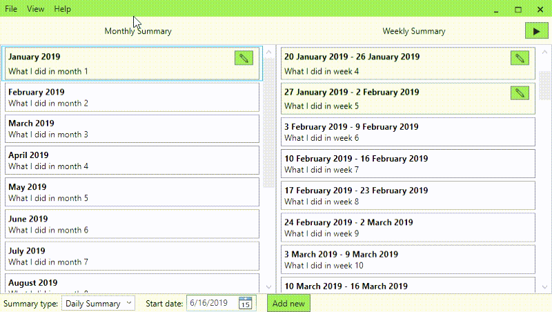

# WHID - What Have I Done

Can you remember everything you did in the last year when it's time to have a career discussion with your boss?
I can't, which is why I wrote this small desktop application.
It lets you quickly summarize and keep track of what you did in a given day, week, month, etc.

## Features

- When filling in a summary for a week, the app will highlight the summaries for each of the days in that week.
  Similarly, a month will highlight the corresponding weeks, and so on.

## How to use

### Requirements

- [.NET Core 3](https://dotnet.microsoft.com/download/dotnet-core/3.0)

### Build and run

- `dotnet build -c Release`
- `.\Whid\bin\Release\netcoreapp3.0\Whid.exe`
